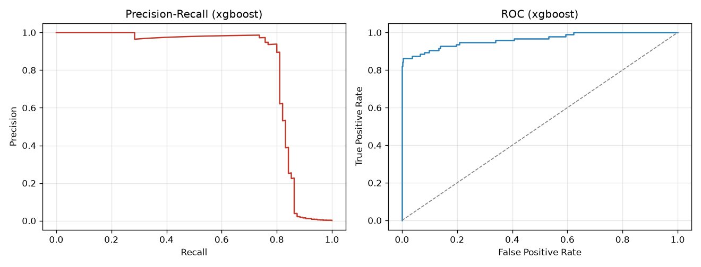
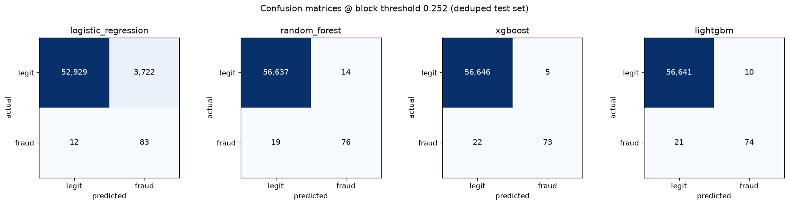
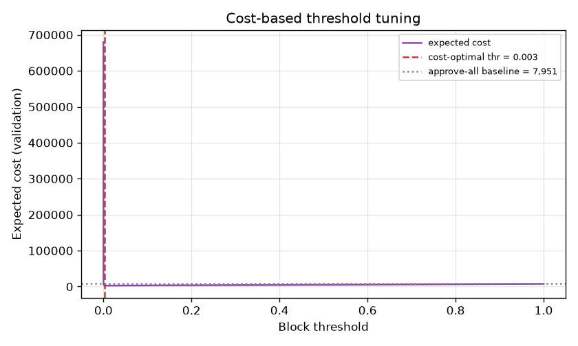

# Transaction Fraud Detection & Risk Decisioning System

End-to-end fraud-risk engine on **real credit-card transaction data**: it scores
every transaction with a fraud probability and turns that score into a business
action — **APPROVE / MANUAL_REVIEW / BLOCK** — using *cost-based* thresholds
rather than an arbitrary 0.5 cutoff.

Built to mirror the kind of risk-decisioning stack used at card networks and
fraud platforms (AmEx, Accertify, etc.): imbalanced-classification modelling,
PR-AUC-first evaluation, and an explicit fraud-cost objective.

---

## Dataset (real)

[Kaggle / ULB "Credit Card Fraud Detection"](https://www.kaggle.com/datasets/mlg-ulb/creditcardfraud) —
284,807 real European card transactions from September 2013, of which **492 are
fraud (0.173%)**. Features `V1..V28` are PCA-anonymised; `Time` and `Amount` are
raw; `Class` is the label.

```bash
# auto-downloaded here (credential-free mirror of the Kaggle file):
curl -sL -o data/creditcard.csv \
  https://huggingface.co/datasets/David-Egea/Creditcard-fraud-detection/resolve/main/creditcard.csv
```

---

## Results (held-out test set, after de-duplication)

Numbers below are **leakage-corrected**: 1,081 duplicate transactions removed
before splitting, and the **best model is selected on the validation split**, so
the test set is untouched until the final report (see *Leakage & overfitting
audit*).

| Model               | val PR-AUC | test PR-AUC | test ROC-AUC |
|---------------------|:----------:|:-----------:|:------------:|
| Logistic Regression | 0.816      | 0.690       | 0.966        |
| Random Forest       | 0.874      | 0.819       | 0.961        |
| **XGBoost** (best)  | **0.883**  | 0.820       | 0.964        |
| LightGBM            | 0.878      | 0.813       | 0.961        |

> PR-AUC (average precision) is the headline metric: with a 0.17% positive rate,
> ROC-AUC looks great for everything, so it can't discriminate between models.
> Removing the duplicate leakage lowered test PR-AUC from an inflated ~0.88 to a
> realistic ~0.82 — that gap *was* the leak.

**Cost-based decisioning (deployed XGBoost policy, test set):**

| | |
|---|---|
| Action thresholds | `APPROVE` < 0.008 ≤ `MANUAL_REVIEW` < 0.252 ≤ `BLOCK` |
| Fraud caught (review+block) | **77 / 95 (81%)** |
| BLOCK precision / recall | 0.94 / 0.77 |
| Manual-review load | 0.08% of traffic (within capacity) |
| Loss vs. approve-everything | **$4,194 vs. $15,408 → ~73% reduction** |

**Precision-Recall & ROC curves (deployed XGBoost):**



**Confusion matrices at the deployed block threshold (test set):**



> Logistic Regression's column shows *why PR-AUC matters*: high recall and great
> ROC-AUC, but a flood of false positives that PR-AUC exposes.

---

## Cost-based threshold tuning

The core idea: a **missed fraud** and a **false alarm** cost very different
amounts, so the operating point is chosen to minimise expected *business cost*,
not to maximise accuracy/F1.

Per transaction the policy weighs three actions:

| Action          | Cost incurred                                              |
|-----------------|-----------------------------------------------------------|
| `APPROVE`       | full transaction `Amount` lost **if** it was fraud        |
| `MANUAL_REVIEW` | `REVIEW_COST` (ops) + residual fraud loss if review misses it |
| `BLOCK`         | `FP_COST` (lost good customer) **if** it was legit        |

Two thresholds `(t_review, t_block)` are grid-searched on a held-out validation
split to minimise total cost, subject to a **manual-review capacity** cap
(analysts can only review a small fraction of traffic). That capacity constraint
is what forces high-confidence fraud to be *blocked* outright instead of
endlessly reviewed. All cost knobs live in [`src/config.py`](src/config.py).



---

## Project layout

```
fraud-detection-system/
├── data/creditcard.csv          # real dataset (auto-downloaded)
├── src/
│   ├── config.py                # paths, cost model, thresholds
│   ├── data.py                  # load + stratified train/val/test split
│   ├── features.py              # scaling + engineered features (hour, log_amount)
│   ├── train.py                 # train 4 models, tune cost thresholds, save
│   ├── evaluate.py              # PR-AUC, ROC-AUC, recall, precision, F1, curves
│   ├── threshold.py             # cost-based threshold + decision-band search
│   └── decision.py              # RiskDecisioner: score -> APPROVE/REVIEW/BLOCK
├── app/dashboard.py             # Streamlit dashboard
├── models/                      # saved model bundles + decision_policy.json
├── reports/                     # metrics.json, curves.png, cost.png
└── run_pipeline.py              # end-to-end entry point
```

---

## Run it

```bash
python3 -m venv .venv && source .venv/bin/activate
pip install -r requirements.txt

python run_pipeline.py            # train + tune + write reports/ and models/
streamlit run app/dashboard.py    # interactive dashboard
```

The dashboard has three tabs: **Overview** (dataset + leaderboard + cost impact),
**Model metrics** (PR/ROC curves, per-model metrics), and **Live decisioning**
(score real transactions into actions with an interactive cost simulator over
the thresholds).

---

## Leakage & overfitting audit

The pipeline was audited; findings and fixes:

| Check | Result |
|---|---|
| **Duplicate rows** | ❌→✅ 1,081 exact duplicates; ~800 straddled train/test. Now dropped before splitting (`DROP_DUPLICATES`). Inflated test PR-AUC by ~0.06. |
| **Model selection on test** | ❌→✅ Best model was chosen by *test* PR-AUC. Now chosen by **validation** PR-AUC; test stays untouched. |
| **Temporal leakage** | ⚠️ Data is time-ordered; the random split leaks "future" rows. A realistic past→future split (`SPLIT_MODE="temporal"`) scores PR-AUC ≈ 0.80 vs 0.82 random — documented and switchable. |
| **Preprocessor scope** | ✅ Scaler `fit` on train only; val/test use `transform`. No leakage. |
| **Threshold tuning** | ✅ Cost thresholds tuned on a held-out validation split, never on test. |
| **Class imbalance weight** | ✅ `scale_pos_weight` / class weights computed from `y_train` only. |
| **Overfitting** | ⚠️ Tree models reach train PR-AUC ≈ 1.0 (full memorisation) vs test ≈ 0.82 — a ~0.12 gap that is expected for these models on separable data; reported metrics are the honest test side, and the best model is the one that generalises best on validation. |

## Hyperparameter tuning

`RandomizedSearchCV` was run for all four models (3-fold stratified CV on the
**train split only**, scoring PR-AUC, with preprocessing inside the CV pipeline
so nothing leaks). Run it with `python -m src.tune` (results in
[`reports/tuning.json`](reports/tuning.json)).

**Verdict: tuning did not beat the hand-picked baselines.**

| Model | baseline val | tuned val | baseline test | tuned test |
|---|:--:|:--:|:--:|:--:|
| **XGBoost** (deployed) | **0.8827** | **0.8761** | 0.8196 | 0.8140 |
| LightGBM | 0.8784 | 0.8718 | 0.8130 | 0.8208 |
| Random Forest | 0.8741 | 0.8741 | 0.8188 | 0.8188 |
| Logistic Regression | 0.8162 | 0.8162 | 0.6904 | 0.6904 |

Takeaways:

- The deltas are **±0.007 PR-AUC — within the noise floor** (only ~95 fraud cases
  per split, so a swing this size is ~1 transaction's worth of ranking). Performance
  here is bounded by the **0.17% positive rate, not hyperparameters**; the real lift
  would come from richer features (velocity, device/geo, merchant risk).
- **Model choice is made on the *validation* column, never test.** XGBoost has the
  highest validation PR-AUC in both the baseline and tuned settings, so it stays
  deployed. LightGBM only leads on *tuned test* — choosing it for that would be
  test-set selection (the very leakage removed in the audit above), so it isn't a
  valid reason to switch.

## Modelling notes

- **Imbalance** is handled *inside* the models (`class_weight="balanced"` /
  `scale_pos_weight`) rather than by resampling — no synthetic rows, no leakage.
- **LightGBM gotcha:** an extreme `scale_pos_weight` (~578) collapses LightGBM's
  ranking here (PR-AUC ≈ 0.05 despite ROC-AUC ≈ 0.93 — a handful of legit rows
  grab the top scores). Switching to `class_weight="balanced"` restores
  PR-AUC ≈ 0.88. XGBoost is unaffected by the same weight.
- **No leakage in thresholds:** the validation split used for threshold tuning
  is carved out before fitting, so reported test metrics never see the
  thresholds that were tuned against them.
- **Best model** is selected by PR-AUC, the correct metric under extreme class
  imbalance.
